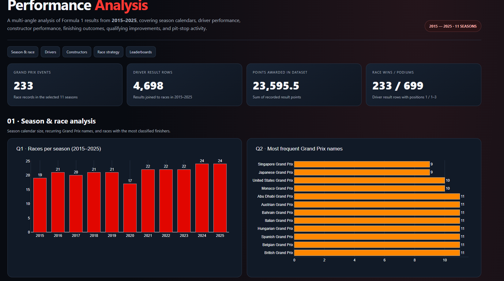
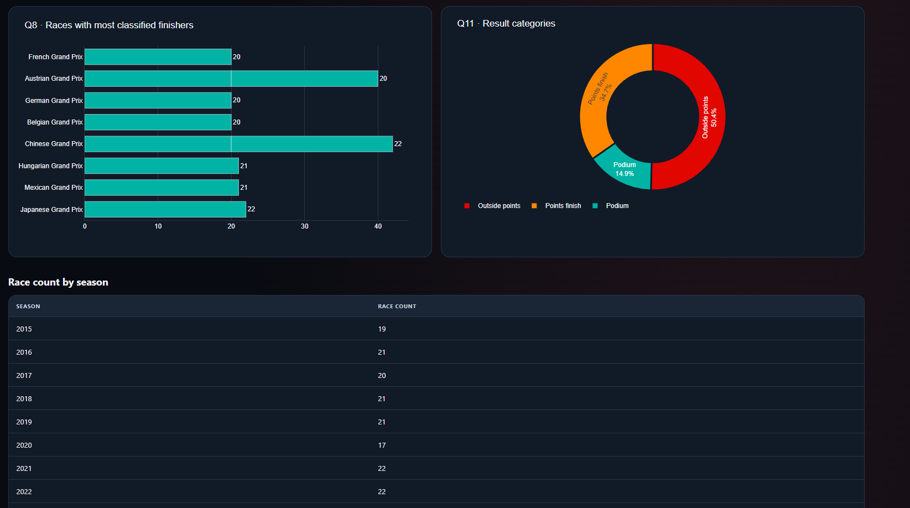

# Formula 1 Performance Analysis (2015–2025)

## Project Overview

This project explores Formula 1 race data from 2015 to 2025 using SQL.
The goal was to practise SQL, answer analytical questions, and understand
driver and constructor performance through data.

This is a beginner-level learning project built to develop practical
SQL and data analysis skills.

## Objectives

- Analyse the number of races across seasons.
- Explore driver points, wins, and finishing positions.
- Compare constructor points and podium finishes.
- Examine qualifying-to-race position improvements.
- Analyse pit stops and race-to-race finishing-position changes.
- Practise SQL concepts through business-style questions.

## Tools Used

- MySQL
- MySQL Workbench
- SQL
- Visual Studio Code
- Power BI (dashboard planned)

## Dataset

The database is named `formula1_analysis` and contains these tables:

- `races`
- `drivers`
- `constructors`
- `results`
- `qualifying`
- `lap_times`
- `pit_stops`

The analysis focuses on the 2015–2025 period.

## SQL Concepts Practised

- Filtering, sorting, and aggregate functions
- GROUP BY and HAVING
- Joins
- CASE statements
- Subqueries
- Common Table Expressions (CTEs)
- Window functions, including DENSE_RANK() and LAG()
- Percentage calculations

## Selected Findings

- The 2024 and 2025 seasons each had 24 races in the dataset.
- Mercedes recorded 6,433.5 total points during the analysis period.
- Mercedes recorded 247 podium finishes.
- Mercedes had a 53.00% podium rate among its recorded result rows.

## Project Structure

```text
formula-1-performance-analysis/
├── data/
│   └── raw/
├── insights/
│   └── analysis_notes.md
├── powerbi/
├── sql/
│   ├── 01_basic_analysis.sql
│   ├── 02_group_by_analysis.sql
│   ├── 03_join_analysis.sql
│   ├── 04_case_analysis.sql
│   ├── 05_subqueries_analysis.sql
│   ├── 06_ctes.sql
│   ├── 07_window_functions.sql
│   └── 08_advanced_analysis.sql
└── README.md
```

## Data Limitations

The driver IDs in the `results` and `drivers` tables are inconsistent.
Consequently, joins between these tables may omit some driver records.

The podium percentage measures podium finishes divided by recorded
driver-result rows, not the percentage of unique Grand Prix events
with a podium finish.

## Learning Outcomes

This project helped me practise SQL on a real-world-style dataset,
develop analytical thinking, compare performance metrics, and document
the findings of a data analysis project.

## Future Improvements

- Build a Power BI dashboard.
- Add dashboard screenshots.
- Publish the project on GitHub.


## Interactive Dashboard

The project includes an interactive HTML dashboard covering Formula 1
performance from 2015 to 2025.

### Dashboard Highlights
- Season-wise race analysis
- Driver points, wins, and podium performance
- Constructor points and podium comparisons
- Qualifying improvements and race finishing positions
- Pit-stop analysis and performance rankings

### View the Dashboard
Open `powerbi/f1_full_performance_dashboard.html` in a web browser.

### Project Documentation
See `insights/analysis_notes.md` for key findings and analytical notes.

## Dashboard Preview





